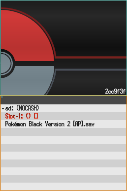
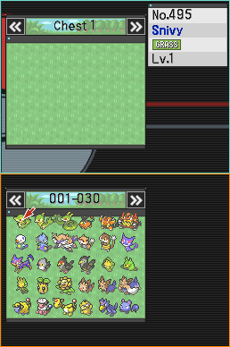
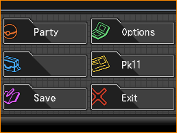
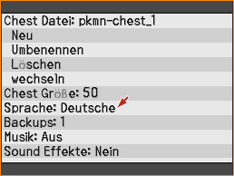
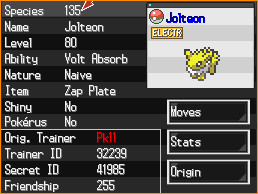
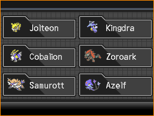
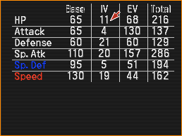

# Pokémon Chest
> A Pokémon Bank for 4th and 5th generation Pokémon games for the Nintendo DS(i).

Pokémon Chest is an app for the DS(i) that can store and edit Pokémon in the DS Pokémon games.
It's current features include:
- Loading save files from DSi SD, Flashcard SD, and retail cartridges
- Storing up to 500 boxes of Pokémon per chest with support for multiple chests
- Editing most of a Pokémon's data
- Injecting pk4/pk5 files from SD
- Dumping Pokémon to pk4/pk5 files
- Translated to English, French, German, Italian, Japanese, Russian, and Spanish

## Download
[Download .nds](){: .btn .hidden #ndsDownload}
[Download .cia](){: .btn .hidden #ciaDownload}
[Release Page](https://github.com/Universal-Team/pkmn-chest/releases/latest){: .btn}

[Dowload nightly .nds](https://github.com/Universal-Team/extras/raw/master/builds/pkmn-chest/pkmn-chest.nds){: .btn}
[Dowload nightly .cia](https://github.com/Universal-Team/extras/raw/master/builds/pkmn-chest/pkmn-chest.cia){: .btn}

## Screenshots
 

 

 

 

## Contact
The best way to talk to us is to join our Discord:

If you want to report a bug you can do so [here](https://github.com/Universal-Team/pkmn-chest/issues/new/choose).

## Credits
### Main Developers
- [Epicpkmn11](https://github.com/Epicpkmn11): GUI code, porting PKSM's save and bank management code
### Translators
- [antoine62](https://github.com/antoine62): French
- [edo9300](https://github.com/edo9300): Italian
- [Epicpkmn11](https://github.com/Epicpkmn11): English and Japanese
- [Extocine](https://twitter.com/@ExtocineN): Russian
- [VoltZ](https://github.com/SuperSaiyajinVoltZ): German
### Others
- [devkitPro](https://github.com/devkitPro), [WinterMute](https://github.com/WinterMute): devkitARM, libnds, and libfat.
- [edo9300](https://github.com/edo9300): [ndsi-savedumper](https://github.com/edo9300/ndsi-savedumper)'s gamecard save dumping and injecting code
- [Flagbrew](https://github.com/FlagBrew): [PKSM](https://github.com/FlagBrew/PKSM)'s save and bank management code
- [RocketRobz](https://github.com/RocketRobz): Adding flashcard and SD being used together and code from [TWiLight Menu++](https://github.com/DS-Homebrew/TWiLightMenu)
- [TotallyNotGuy](https://github.com/TotallyNotGuy): Finding & making graphics and the Pokémon Center generation 4 & 5 songs
- [VoltZ](https://github.com/SuperSaiyajinVoltZ): Idea to make a Pokémon Bank for the DS(i)
### Music
- [Pokémon Center (Gen 1)](https://modarchive.org/index.php?request=view_by_moduleid&query=181718), [Elm's Lab](https://modarchive.org/index.php?request=view_by_moduleid&query=181711), [Oak's Lab](https://modarchive.org/index.php?request=view_by_moduleid&query=181717), and [Game Corner](https://modarchive.org/index.php?request=view_by_moduleid&query=181756).
