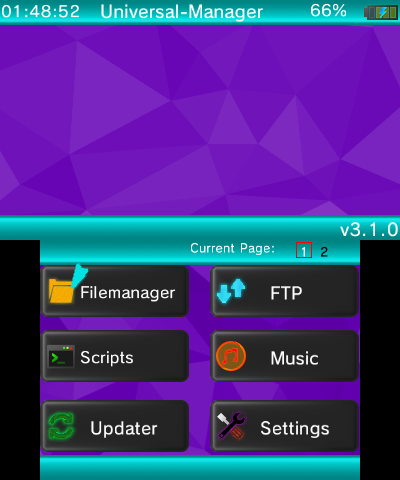
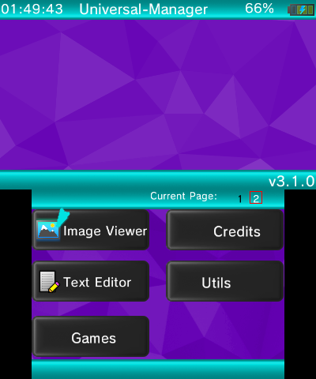

# Universal-Manager

> Multimedia tool for Nintendo DSi, Nintendo 3DS and Nintendo Switch.

Universal-Manager is a Multimedia Tool for the Nintendo DSi, Nintendo 3DS and Nintendo Switch.
Currently the Nintendo 3DS Version is the most common one, it has a lot of Features!
Example Features are : 
- Hearing Music with Universal-Manager's Music Player!
- Watch Images up to 1024x576 Pixel with Universal-Manager's Image Viewer!
- Customize the Colors from the Bar or the BG and much more in the Settings!
- Transfer Files Wirelessly via Universal-Manager's FTP Server!
- Update Homebrew and Apps like TWiLightMenu++ or NDS-Bootstrap or download even Pokémon Chest!

There is much more to discover in Universal-Manager! ;P

## Wiki
You can visit Universal-Manager's Wiki for more information about Universal-Manager and it's Features :

[Wiki](https://github.com/Universal-Team/Universal-Manager/wiki){: .btn}

## Download

Here you can find the Download Links to Universal-Manager. (Currently only the 3ds Version.)

The NDS and Switch Version will follow when it is usable.

Latest version is: [latest](https://github.com/Universal-Team/Universal-Manager/releases/latest){: #latestVersion}

[Download .3dsx](){: .btn .hidden #n3dsxDownload}
[Download .cia](){: .btn .hidden #ciaDownload}
[Release Page](https://github.com/Universal-Team/Universal-Manager/releases/latest){: .btn}

[Dowload nightly .3dsx](https://github.com/Universal-Team/extras/raw/master/builds/Universal-Manager/Universal-Manager.3dsx){: .btn}
[Dowload nightly .cia](https://github.com/Universal-Team/extras/raw/master/builds/Universal-Manager/Universal-Manager.cia){: .btn}

## Screenshots
Here are some Screenshots from Universal-Manager!

## Contact
The best way to talk to us is to join our Discord:

If you want to report a bug you can do so [here](https://github.com/Universal-Team/Universal-Manager/issues/new/choose).

## Credits
### Main Developers
- [Epicpkmn11](https://github.com/Epicpkmn11) : Helped me a lot by problems or Mistakes.
- [Universal-Team](https://github.com/Universal-Team) : Without the whole Team, we probably couldn't do such a great Application like Universal-Manager with those Graphics and such.
- [VoltZ](https://github.com/SuperSaiyajinVoltZ) : Main Developer of Universal-Manager and previous Universal-Updater.
### Others
- [devkitPro](https://github.com/devkitPro), [Fincs](https://github.com/fincs), [Smealum](https://github.com/smealum), [WinterMute](https://github.com/WinterMute) : devkitARM, libnds, libfat, Libctru, Citro2D, Citro3D and LibNX.
- [Flagbrew](https://github.com/FlagBrew): [PKSM](https://github.com/FlagBrew/PKSM)'s Basic Citro2D GUI Stuff, so I was able to work with Spritesheets and Graphics.
- [FlameKat53](https://github.com/FlameKat53) : For Helping me out with the Azure Things.
- [Joel16](https://github.com/joel16) : [3DShell](https://github.com/joel16/3DShell) : For the FTP, external Image, some GUI Functions like Text Drawing and Audio Code.
- [RocketRobz](https://github.com/RocketRobz):[PDSX-3D](https://github.com/RocketRobz/PDSX-3D) : For the Animated Background Code from PDSX-3D.
- [TotallyNotGuy](https://github.com/TotallyNotGuy): For making almost all of the Graphics from Universal-Manager.