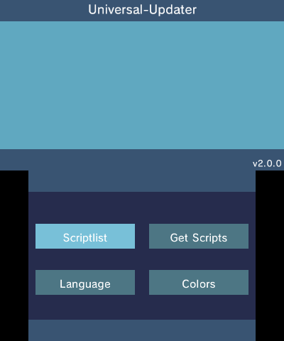
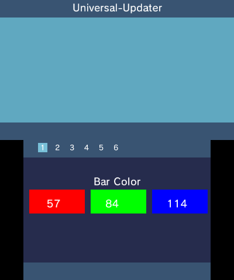
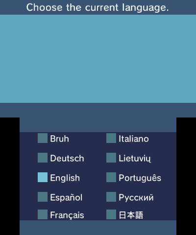
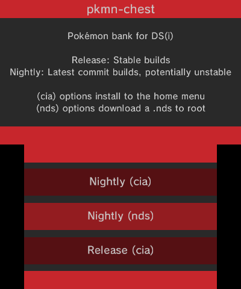

# Universal-Updater

> A universally good updater for Nintendo 3DS.

Universal-Updater is a 3DS homebrew that allows easy installation and updating of other 3DS homebrew!

Some features include:

- Flexible and easy to make scripts
- Pre-made scripts that anyone can submit available for download from within the app
- Translated to English, French, German, Italian, Japanese, Lithuanian, Portuguese, Russian, and Spanish
- Customizable interface colors

## Wiki
You can visit Universal-Updater's Wiki for more information about Universal-Updater and it's Features:

[Wiki](https://github.com/Universal-Team/Universal-Updater/wiki){: .btn}

## Download

You can find the download Link to Universal-Updater here:

Latest version is: [latest](https://github.com/Universal-Team/Universal-Updater/releases/latest){: #latestVersion}

[Download .3dsx](){: .btn .hidden #n3dsxDownload}
[Download .cia](){: .btn .hidden #ciaDownload}
[Release Page](https://github.com/Universal-Team/Universal-Updater/releases/latest){: .btn}

[Dowload nightly .3dsx](https://github.com/Universal-Team/extras/raw/master/builds/Universal-Updater/Universal-Updater.3dsx){: .btn}
[Dowload nightly .cia](https://github.com/Universal-Team/extras/raw/master/builds/Universal-Updater/Universal-Updater.cia){: .btn}

## Screenshots

Here are some Screenshots from Universal-Updater:

## Contact
The best way to talk to us is to join our Discord:

## Credits
### Main Developers

- [Epicpkmn11](https://github.com/Epicpkmn11) : Helped me by the JSON parsing stuff and a lot more!
- [VoltZ](https://github.com/SuperSaiyajinVoltZ) : Main Developer of Universal-Updater.
### Translators

English
- [VoltZ](https://github.com/SuperSaiyajinVoltZ)

French
- [antoine62](https://github.com/antoine62)

German
- [VoltZ](https://github.com/SuperSaiyajinVoltZ)

Italian
- [Roby Spia](https://crowdin.com/profile/robyspia67)

Japanese
- [Epicpkmn11](https://github.com/Epicpkmn11)

Lithuanian
- [lemonnade0](https://steamcommunity.com/profiles/76561198276444028)

Portuguese
- [Chips](https://github.com/Ch1p5)
- [David Pires](https://github.com/DavidPires)

Russian
- [_Mapple²](https://gitlab.com/of228lo)

Spanish
- [YoSoy](https://twitter.com/riku200)
### Others

- [devkitPro](https://github.com/devkitPro), [Fincs](https://github.com/fincs), [Smealum](https://github.com/smealum), [WinterMute](https://github.com/WinterMute) : devkitARM, Libctru, Citro2D, and Citro3D.